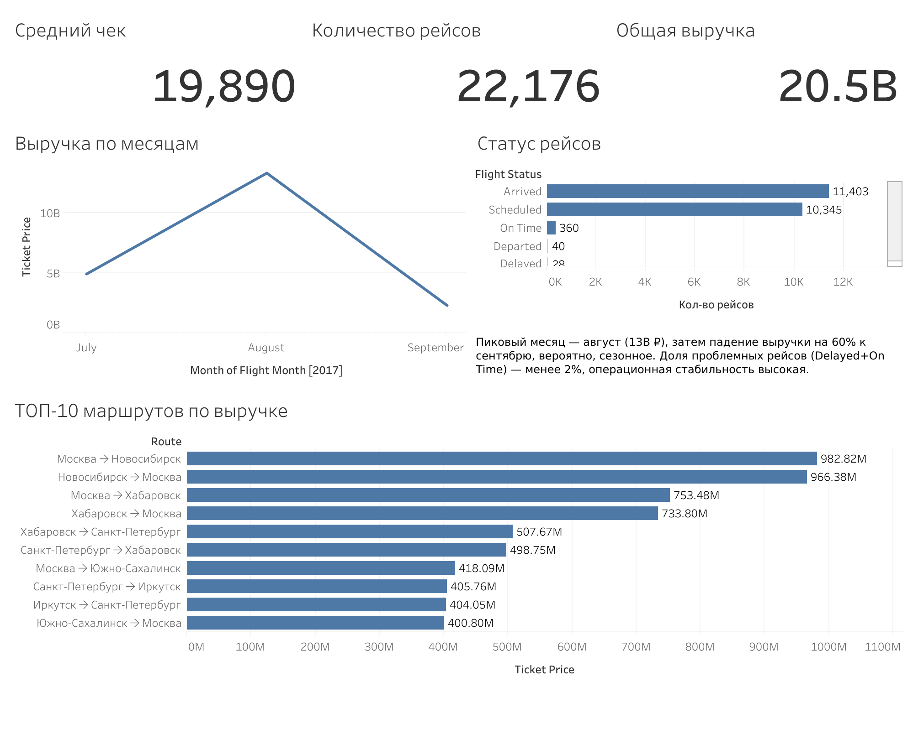

# ✈️ Продажи авиабилетов: SQL-анализ и дашборд (июль–сентябрь 2017)

Анализ данных о продажах авиабилетов на базе демо-датасета PostgreSQL "bookings": 
SQL-запросы для выявления ключевых маршрутов, сезонности выручки и операционной 
стабильности рейсов, плюс интерактивный дашборд в Tableau.

## TL;DR

- Общая выручка за период — **20.5 млрд ₽**, 22 176 рейсов, средний чек — 19 890 ₽
- Пиковый месяц — **август (13 млрд ₽)**, к сентябрю выручка падает почти на 60% — 
  выраженная сезонность спроса
- Топ-маршруты — рейсы между Москвой и региональными хабами (Новосибирск, Хабаровск): 
  на них приходится основная доля выручки
- Доля проблемных рейсов (задержки + вылеты не по расписанию) — **менее 2%**, 
  операционная стабильность высокая

[Дашборд в Tableau Public](https://public.tableau.com/views/Dashboard_Airlines/-2017?:language=en-US&:sid=&:redirect=auth&:display_count=n&:origin=viz_share_link) · [SQL-запросы](./sql)

## Данные

Источник: [демо-база "bookings"](https://postgrespro.com/education/demodb) — учебная 
база данных авиакомпании для PostgreSQL (рейсы, билеты, посадочные талоны, аэропорты, 
самолёты). Период: июль–сентябрь 2017.

Итоговая витрина для BI (`flight_sales_summary.csv`) собрана SQL-вью `03_views_for_bi.sql` 
и содержит один ряд на билет: рейс, маршрут, дату, модель самолёта, статус, класс 
обслуживания и цену.

## SQL-запросы

| Файл | Что делает |
|---|---|
| [`01_route_analysis.sql`](./sql/01_route_analysis.sql) | Топ-10 маршрутов по количеству рейсов и по выручке |
| [`02_delays_and_load.sql`](./sql/02_delays_and_load.sql) | Доля отменённых рейсов по моделям самолётов, динамика выручки по месяцам, средняя загрузка самолёта |
| [`03_views_for_bi.sql`](./sql/03_views_for_bi.sql) | VIEW, объединяющее рейсы, аэропорты, самолёты и билеты в плоскую витрину для BI-инструментов |

## Дашборд

Дашборд собран в Tableau Public на основе витрины `flight_sales_summary`. Включает:
- Ключевые метрики: средний чек, количество рейсов, общая выручка
- Динамику выручки по месяцам
- Разбивку по статусам рейсов
- Топ-10 маршрутов по выручке

## Ключевые выводы

1. **Сезонность.** Пик выручки в августе (13 млрд ₽) с падением на 60% к сентябрю — 
   вероятно, эффект окончания летнего отпускного сезона. Стоит учитывать при планировании 
   загрузки и ценообразования на осень.
2. **Концентрация выручки.** Основная выручка формируется на маршрутах Москва-Новосибирск 
   и Москва-Хабаровск — это ключевые направления для приоритизации в продажах и маркетинге.
3. **Операционная надёжность.** Доля задержанных и внеплановых рейсов — менее 2% от общего 
   числа, что говорит о стабильной операционной работе авиакомпании в этот период.

## Стек

PostgreSQL · SQL · Tableau Public
